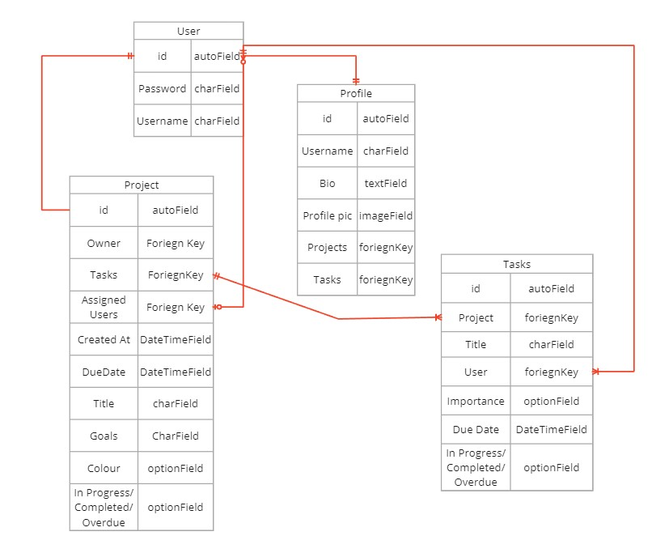
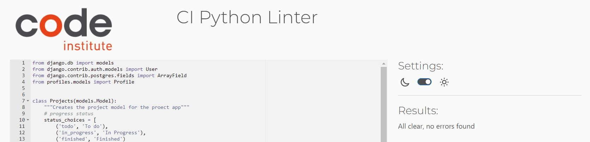
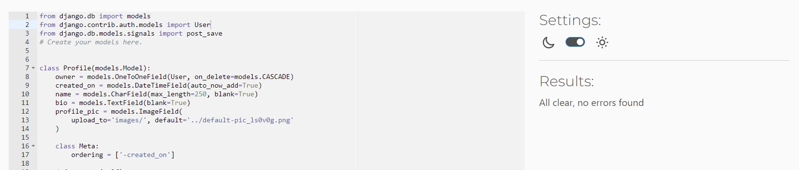

# Crack-It API

## Project description: 

‘Crack-it’ is a task management app. Designed to be as simple and easy to use as possible to make organising projects quick, easy, and fool-proof. The application consists of an API and a front-end React.js application. This is the documentation for the back-end API. 

[The front end repository can be found here](https://github.com/alcl2000/Amy-Lewis-PP5-FE)

## Entity Relationship diagram:

## Models and CRUD breakdown:

<table>
  <tr>
   <td>Model
   </td>
   <td>Endpoint(s)
   </td>
   <td>Create
   </td>
   <td>Retrieve
   </td>
   <td>Update
   </td>
   <td>Delete
   </td>
   <td>Filter
   </td>
   <td>Text search
   </td>
  </tr>
  <tr>
   <td>Users
   </td>
   <td>users/

users/:id/
   </td>
   <td>Yes
   </td>
   <td>Yes
   </td>
   <td>Yes
   </td>
   <td>No
   </td>
   <td>No
   </td>
   <td>No
   </td>
  </tr>
  <tr>
   <td>Profiles
   </td>
   <td>profiles/

profiles/:id/
   </td>
   <td>Yes (auto)
   </td>
   <td>Yes
   </td>
   <td>Yes
   </td>
   <td>No
   </td>
   <td>Projects, 

Tasks
   </td>
   <td>Username
   </td>
  </tr>
  <tr>
   <td>Projects
   </td>
   <td>projects/projects/:id
   </td>
   <td>Yes
   </td>
   <td>Yes
   </td>
   <td>Yes
   </td>
   <td>Yes
   </td>
   <td>Owner
   </td>
   <td>Title, 

Owner
   </td>
  </tr>
  <tr>
   <td>Tasks
   </td>
   <td>Tasks/tasks/:id
   </td>
   <td>Yes
   </td>
   <td>Yes
   </td>
   <td>Yes
   </td>
   <td>Yes
   </td>
   <td>Owner,

Important,

Project
   </td>
   <td>Owner, Important, 

Project
   </td>
  </tr>
</table>

## User story testing - Back end

<table>
  <tr>
   <td>User story
   </td>
   <td>Acceptance criteria
   </td>
   <td>Mapping API feature
   </td>
   <td>Pass/Fail
   </td>
  </tr>
  <tr>
   <td>As a user I want to be able to organise similar tasks into projects as a way of breaking up jobs into smaller tasks
   </td>
   <td>
<ul>

<li>Users are able to create tasks 

<li>Project ID, Assigned Users and importance state are able to be able to set independently of each other
</li>
</ul>
   </td>
   <td>Create Projects

Create Tasks
   </td>
   <td>Pass
   </td>
  </tr>
  <tr>
   <td>As a user I want to set deadlines for Tasks and Projects so that I can enhance organisation and to encourage users to work more efficiently
   </td>
   <td>
<ul>

<li>Deadlines can easily be set for tasks and projects

<li>Deadlines can be extended for tasks

<li>Deadlines for projects can be extended

<li>Deadlines for tasks cannot be longer than the deadline for the project as a whole
</li>
</ul>
   </td>
   <td>Create Projects

Create Tasks
   </td>
   <td>Pass
   </td>
  </tr>
  <tr>
   <td>As a user I want to be able to set tasks as important in order to better allocate resources when working on a project
   </td>
   <td>
<ul>

<li>Users should be able to set tasks as important

<li>When looking at tasks on the homepage or in the project detail page, users should be able to sort by the most important tasks

<li>Users should be able to set tasks as important at any time and reverse it as well
</li>
</ul>
   </td>
   <td>Create Tasks
   </td>
   <td>Pass
   </td>
  </tr>
  <tr>
   <td>As a user I want to be able to set tasks as not started/in progress/complete so that I can see clear progress towards my goals and the project as a whole
   </td>
   <td>
<ul>

<li>Tasks should automatically be set to not started when created

<li>When a user interacts with it, they can change the state of the task to in progress

<li>When a task is completed, it displays as crossed out

<li>Tasks can be reopened if needed
</li>
</ul>
   </td>
   <td>Create Tasks

Edit Tasks
   </td>
   <td>Pass
   </td>
  </tr>
  <tr>
   <td>As a user I want to be able to set specific, targeted goals for a project so that users can see the goals for the project and what they are working towards
   </td>
   <td>
<ul>

<li>Users can set up to three goals for a project, to work as a description

<li>Users may edit the goals at any point

<li>The goals are displayed clearly on the project's homepage
</li>
</ul>
   </td>
   <td>Create Projects

Edit Projects
   </td>
   <td>Pass
   </td>
  </tr>
  <tr>
   <td>As a user I would like to be able to create a profile to share my work with other users and to ensure that I'm allowing access to the right people
   </td>
   <td>
<ul>

<li>Users can create a profile, with a profile picture and bio

<li>Users can edit that profile when desired

<li>A user's profile displays which projects they are involved in
</li>
</ul>
   </td>
   <td>Create Profile (automatic)

Dj-rest-auth - create User
   </td>
   <td>Pass
   </td>
  </tr>
  <tr>
   <td>As a user I want to add my friends and teammates to our projects so that we can work collaboratively and assign each other tasks
   </td>
   <td>
<ul>

<li>Users can add their collaborators to projects, who can then interact with the projects

<li>They can also remove Users, if they wish
</li>
</ul>
   </td>
   <td>Dj-rest-auth - create User

Edit Projects

Edit Tasks
   </td>
   <td>Pass
   </td>
  </tr>
</table>

## Validation 

- The code has been validated using the auto pep8 validator within my IDE, and Code Insitute's own code validator 
- All custom models and custom python files pass validation 
- The Task app
    - 
- The Project app
    - 
- The Profiles app
    - 

## Automated testing:

The automated tests for this project were written using pytest and the Django rest API’s custom ‘API test case’ the following tests were written and the app has 94% coverage according to htmlcov.

* Tasks Model: 
    * Users can retrieve task list
    * Logged in users can create tasks
    * Non logged in users can’t create tasks
    * Can retrieve task with valid id
    * Can’t retrieve a task with an invalid id
    * User can update own tasks
    * User can’t update others tasks
* Project Model:
    * Can retrieve project list
    * Logged in user can create projects
    * Non logged in user can't create projects
    * Can retrieve project with valid id
    * Can't retrieve project with invalid id
    * User can update own projects
    * User can’t update others projects
* Profile Model:
    * Users can retrieve profiles list
    * Profile created automatically with user
    *  User can retrieve profile with valid id
    * User can’t retrieve profile with invalid id
    * User can edit own profile
    * User can't edit others profiles

## Errors:

* Error: 'Operation error' no such table as 'project_project' 
    * This error occurred when trying to perform queries, tests and run the server 
    * This error occurred as a result of having stuck/corrupted database migrations in the migrations folder. The error was easily resolved by deleting previous migrations and then re-migrating the project
* Error: 'django.db.utils.OperationalError: near "[3]": syntax error'
    * Error occurred during development - the format of a projects ‘goals’ field was changed to one which was dependant on a PostgreSQL field, which would interfere with the local databases
    * The format of this field was returned to the way it was before, so that the database format could be used in both the test and production databases
* Error: Heroku web app crash code h:10
    * This error occurred during deployment to Heroku, displaying the h:10 error code with the reference “DRF_API module not found”
    * This error occurred due to an improper configuration of the Procfile from a previous project
    * Resolved by editing the Procfile and re-deploying
    * 

## Deployment Steps:

* Firstly, within your settings.py file:
* Make sure the dj-database-url and psycopg2 libraries are correctly installed
* Configure your dj-rest-auth library for JWTs
* Set ‘allowed hosts’ to the deployed app’s url
* Add a Procfile, to run the commands to correctly deploy your app
* Use the command ‘pip3 freeze > requirements.txt’ to create requirements file
* Go to Heroku.com and either sign in or create a new account
* From your dashboard click to create a new app
* Select a host in your region
* Once created: 
    * Collect the following variables from your env.py file:
        * Database URL
        * Cloudinary (or other cloud media hosting platform) URL
        * Secret Key
    * Add the following to the settings:
        * DISABLE_COLLECTSTATIC = 1
        * CLIENT_ORIGIN, with the url set to the deployed version of your front end app
        * CLIENT_ORIGIN_DEV, with the url set to the development url of your front end app
